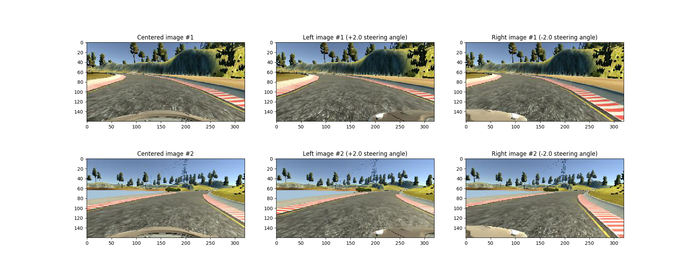
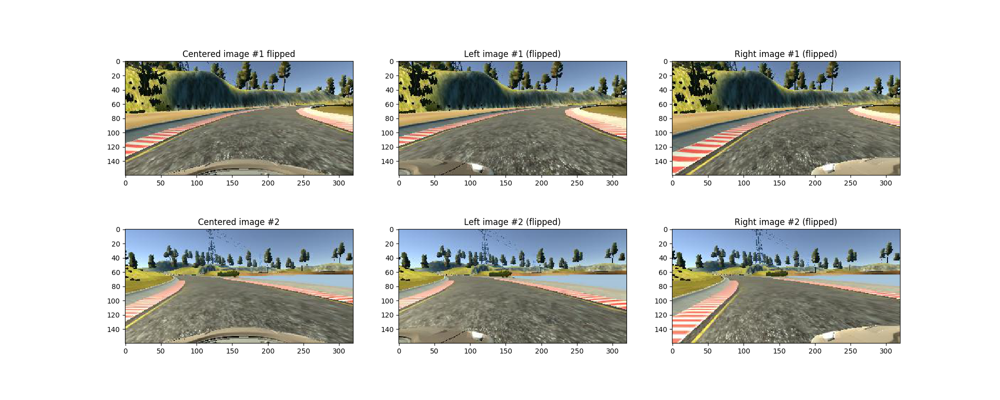

# **Behavioral Cloning** 

Implementation and documentation by Kevin Hubert

## Intro

The project was impelemted as the fourth project of the "Self-Driving car engineer" Nanodegree program at Udacity.com. My project contains the following parts to fulfill all requirements declared by udacity:
- Use the simulator to collection driving behavior data
- Build a neural network in keras to predict the steering angles based on the images collected and steering values in the simulator before
- Train and validate the previous builded model using a training and validation set
- Test the trained model - let it drive autonomously through the track at least one leap without leaving the road
- Record a video of the car driving through the track (record images which are used to create the video)
- Create a writup/documentation for the project

---

## Project submission
My project submission include the required files to train the model, run the simulator in autonomous mode (trained model) and the required documentation
* model.py - Python script which creates, trains and validates the model based on the given data set from the simulator
* model.h5, model_2.h5, model_3.h5 - Different trained models which were created/trained using the "model.py"-script. I've saved multiple trained neworks, to ensure that the model trains reliable
* video.mp4 - Video of the trained model driving autonomously in the simulator. 
* documentation.md - Documentation of the project
* ./run1 - This directory contains all images which were recorded during the autonomous drive of the trained model in the simulator. (base for video.mp4)
* ./next_data - Images and the specific csv-file which contains the additional meta-information like steering angle, speed-values etc - recorded within the simulator.


## Train/Run model
### Train
Use the following command to train the modal (Attention: Ensure that keras is running on the GPU. CPU can take a lot of time)
```sh
python model.py
```
The trained model will be saved in the end. The file to save the trained model can be configured at the end of the model.py

### Run (with trained model)
Use drive.py to let the model drive autonomously in the simulator. Ensure to select "Autonoumous" when starting the simulator.
Replace "model-file" by the trained-model-file-path.
"directory-name" is optional, this will save the images of the autonoumous drive in the given folder
```sh
python drive.py <model-file> [directory-name]
```

### Generate video
The following command can be used to generate a video out of the images recorded in the autonoumous drive. The video will be saved as "<directory-name>.mp4"
```sh
python video.py <directory-name>
```

#### 3. Submission code is usable and readable

The file model.py contains the code to create, train and save the convolutional neural network. All steps of the model are explained in detail within comments in the code.
In general the model works as described here:
Read in the csv-file generated by the simulator which contains the steering-angles and the paths for the centered-/left-/right-mounted camera images during the recording 
in the simulator. Use the readin images and steering-values to generated additional data by flipping the image horizontally and negate the steering-values, this is especially useful
because the track is mostly left-turned and by flipping the images the networks can more easliy generalize the data to learn and has twice as much data as recorded.
Without the flipped images it could be possible that the network won't be able to drive autonomous when the track changes and/or is not longer left-turn oriented.

Split the recorded dataset 80:20 for training:validation the validation dataset is used to estimate if the trained model is over-/underfitting (based on the delta of the training vs validation accurancy). After splitting the data a generator is created for both the training- and the validation-dataset, this is used to avoid to load the entrie dataset in the memory to train/validate the model instead only the currently required data for the given batch-size is loaded into memory. For sure the training within the generators is slower, because the data is loaded into memory only when required and the data is loaded into memory for each epoch, on the other hand this is the way to go when not enough memory in available on the given machine (you can adjust the batch-size, to load more/less data into the memory during the training/validation). Moreover the generator shuffles the given data for training and validation, by shuffling the data the network is less likely to learn the given data based on a specific order (learns more generalized (less probablity for overfitting)).
In the next step the model is created and trained. A summary of the model architecture is shown below (generated with the model.summary()-function)
The model uses the adam-optimizer and "mse" (mean square error) as a loss-function.
  
Model architecture:
My model architecture is inspired by the following two architectures:
- LeNet: https://miro.medium.com/max/4308/1*1TI1aGBZ4dybR6__DI9dzA.png
- NVIDIA - Self driving car network: https://miro.medium.com/max/3236/1*HwZvJLpALucQkBuBCFDxKw.png

I've decided to use a model inspired by both of the references models above, because using the LeNet-architecture my model seemed to underfit for the given dataset especially in the harder parts of the track (e.g. the bridge). On the other hand the NVIDIA model had alot of more layers/neurons which semmed to be way to complex for the given dataset (overfitting).
Additional i've added dropouts of 0.3 (30%) after each conv-layer to avoid overfitting. Moreover there is no activation-function in the output-layer because the task for the network is to predict the steering-angle (floating-point-number from 0.0 - 25.0) which is a regressions- and not a classification-task.
  
After training my models i've runned the model in autonoumous-mode in the simulator to see if it fits the expections. Especially at the begin i had a few models which underfitted the data (leave the street, drived out of the curve), later i had a few models which fit the data quite good but failed at specific positions in the track, e.g. on the bridge. The data-generation (horizontally image flipping) in combinations with dropouts (avoid overfitting) solved the problem for me. 
  
_________________________________________________________________
Layer (type)                 Output Shape              Param #   
=================================================================
cropping2d_1 (Cropping2D)    (None, 90, 320, 3)        0         
_________________________________________________________________
lambda_1 (Lambda)            (None, 90, 320, 3)        0         
_________________________________________________________________
conv2d_1 (Conv2D)            (None, 43, 158, 6)        456       
_________________________________________________________________
dropout_1 (Dropout)          (None, 43, 158, 6)        0         
_________________________________________________________________
conv2d_2 (Conv2D)            (None, 20, 77, 32)        4832      
_________________________________________________________________
dropout_2 (Dropout)          (None, 20, 77, 32)        0         
_________________________________________________________________
conv2d_3 (Conv2D)            (None, 8, 37, 24)         19224     
_________________________________________________________________
dropout_3 (Dropout)          (None, 8, 37, 24)         0         
_________________________________________________________________
conv2d_4 (Conv2D)            (None, 2, 17, 24)         14424     
_________________________________________________________________
dropout_4 (Dropout)          (None, 2, 17, 24)         0         
_________________________________________________________________
flatten_1 (Flatten)          (None, 816)               0         
_________________________________________________________________
dense_1 (Dense)              (None, 120)               98040     
_________________________________________________________________
dense_2 (Dense)              (None, 84)                10164     
_________________________________________________________________
dense_3 (Dense)              (None, 10)                850       
_________________________________________________________________
dense_4 (Dense)              (None, 1)                 11        
=================================================================
Total params: 148,001
Trainable params: 148,001
Non-trainable params: 0
_________________________________________________________________

  
## Appropriate training data
The data to train the model was chosen to keep the car in the middle of the road. The data to train the model was generated by driving the track two times in the required direction and one time in the opposite direction to ensure a more generalized learning of the network. 
Instead of adding additional data to train the model to recover from the left-/right-side of the road to the middle, i've used the right-/left-mounted-camera-image from the simulator and add/substract a correction-value so the model learns to recover back to the center of the road-line.
  
## Creation of the training set
As described above i've generated the data within the simulator which records 3 different images for each position (center-/left-/right-mounted-camera).
A few of these picture can be seen here:


Additionally i've took those images and flipped them horizontally which increase the amount of training-data and ensures that the model has more data for right-turns. (Training track mostly consists of left turns). The flipped version of the images from above: 

  
In my case i've used a batch-size of 128 ad 3 epochs to train the model.
